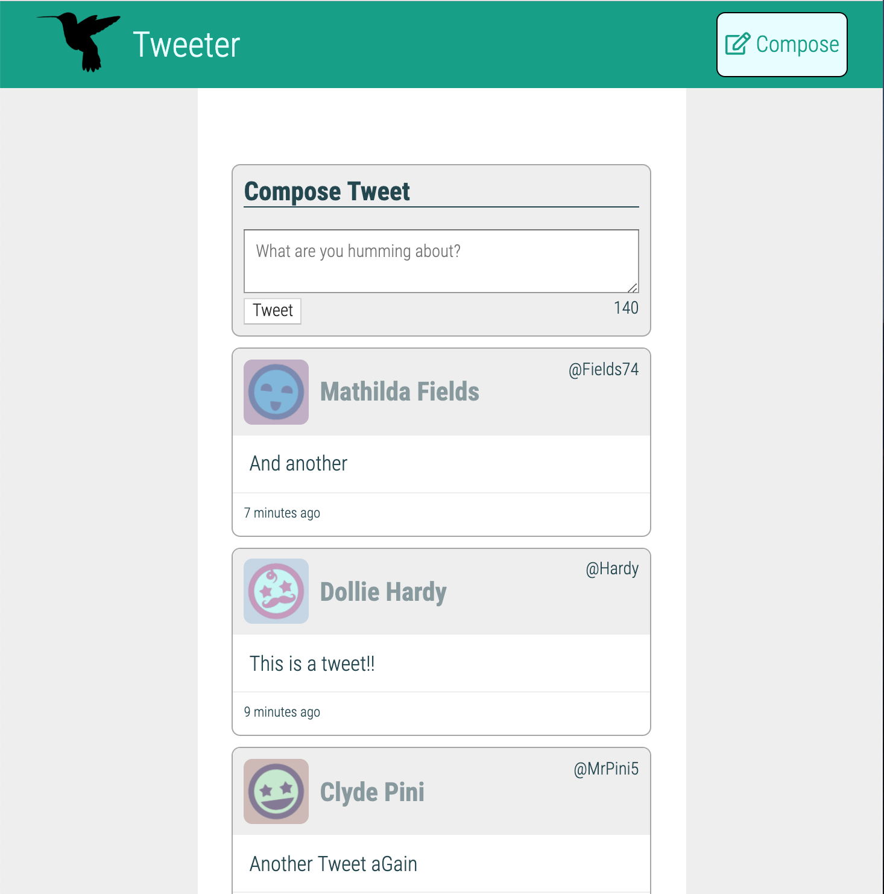
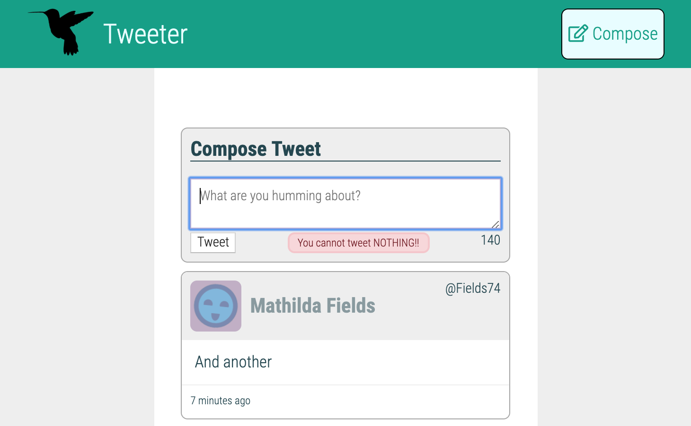

# Tweeter Project

Tweeter is a simple, single-page Twitter clone powered by `HTML, CSS, JS, jQuery, AJAX` on the front end and `Node, Express, MongoDB` in the back end. It was built upon starter code provided by lighthouse labs.

## Getting Started

1. Fork and clone this repository.
2. Install dependencies using the `npm install` command.
3. Install MongoDB (https://www.mongodb.com/) and create a tweets collection.
4. Start the web server using the `npm run local` command. The app will be served at <http://localhost:8080/>.
5. Go to <http://localhost:8080/> in your browser.
6. Happy Tweeting!!

## Sceenshot of App

#### Error Message Showing

## Dependencies

- Node 5.10.x or above
- body-parser: ^1.15.2
- chance: ^1.0.2
- express: ^4.13.4
- md5: ^2.1.0
- mongodb: ^2.2.36